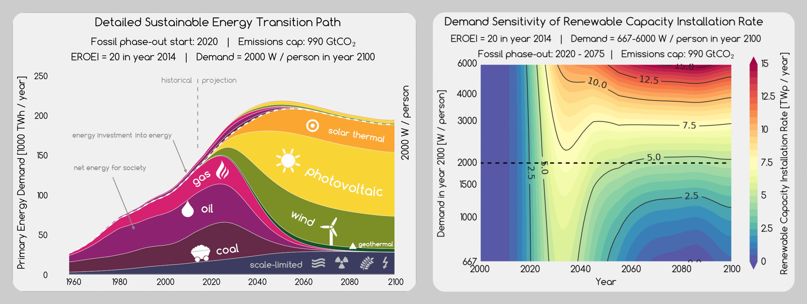

[  Sustainable Energy Transitions](http://set.csaladen.es/)
===
  

Investigating how society needs to be aware of EROEI (energy return on energy invested) dynamics of the different energy sources as it transitions away from fossil fuels.  A project by [Sgouris Sgouridis](http://www.ssgouridis.org/) and [Dénes Csala](http://www.csaladen.es/) at [Masdar Institute of Science and Technology](http://www.masdar.ac.ae/)
  
__This is an interactive global visualization and exploration interface (_exploratorium_)__.  
  
# App
Try: http://set.csaladen.es

# Articles
1. Sgouridis, Csala, [A Framework for Defining Sustainable Energy Transitions: Principles, Dynamics](http://www.mdpi.com/2071-1050/6/5/2601), and Implications, 2014, Sustainability
2. Sgouridis, Bardi, Csala, [A Net Energy-based Analysis for a Climate-constrained Sustainable Energy Transition](http://arxiv.org/abs/1503.06832), 2015, preprint on arXiv
3. Sgouridis, Csala, Bardi, [The Sower's way. Quantifying the Narrowing Net-Energy Pathways to a Global Energy Transition](http://iopscience.iop.org/article/10.1088/1748-9326/11/9/094009), 2016, Env. Res. Let.

# Models
- SET Model 1.0 | [Online simulator](http://set.csaladen.es/set.html) | [AnyLogic ALP source file](http://set.csaladen.es/models/set.zip)
- SET Model 2.0 | [Online simulator](http://set.csaladen.es/set2.html) | [AnyLogic source file](http://set.csaladen.es/models/set2.zip)

# Cite
Please use articles (1) and (3) to refer to this work. Contact the authors ([Dénes](d.csala@lancaster.ac.ae), [Sgouris](ssgouridis@masdar.ac.ae)) if you would like to use the data presented on this website more extensively or you would like to collaborate on the project.

# Description
You can find a detailed description of the model creation, data mining and analysis and visualization [here](http://set.csaladen.es/#&description), in the __Workflow__ section. The code is presented in interactive Jupyter notebooks that you can download and run yourself.

# Credit
Dénes Csala, 2016  
http://csaladen.es
